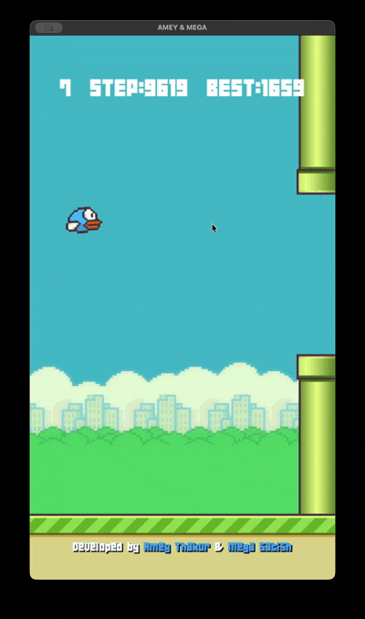

<div align="center">

# Flappy Bird RL

### A Q-learning agent that teaches itself to play Flappy Bird

<p>
  
  
  
  
  
</p>

<!-- Swap this for an actual screenshot or GIF of the agent playing -->


</div>

---

## Table of Contents

- [About](#-about)
- [How the Agent Learns](#-how-the-agent-learns)
- [Installation](#-installation)
- [Usage](#-usage)
- [Project Structure](#-project-structure)
- [Configuration](#-configuration)
- [Training Logs & Checkpoints](#-training-logs--checkpoints)
- [Roadmap](#-roadmap)
- [Credits](#-credits)
- [License](#-license)

---

## About

A Flappy Bird clone (built on Pygame) paired with a tabular **Q-learning** agent that learns to play through trial and error — no hand-coded control logic, just states, actions, and rewards.

I have recently taken on the theory of learning Q-learning and how it can effect the movements of an agent in an environment. The thought came when trying figure out how to approach the reinforcement learning problem I will take on in ros. I wanted to start out simple so I found a flappy bird game I could manipulate online (credits to the makers are at the bottom of the README). I watched this [video](https://www.youtube.com/watch?v=VnpRp7ZglfA&list=LL) which game me an short insight into **MARKOV's PRINCIPLE** which is just a fancy way of saying:
### Variables
- Agent: what we want manipulated
- Environment: what we can't manipulate but want the agent to learn from

### Thought process
- State: Current information - EXAMPLES: position, velocity
- Action: What are the only things we can do in this instance - EXAMPLES: jump or no jump
- Reward: How do we want to get the agent to learn right from wrong.

I explain more of how I went about solving this approach more in this README, but feel free to learn and try this thought process in your own games :)

---

## How the Agent Learns

<details>
<summary><b>State representation</b></summary>

<br>

The agent discretizes the raw game info into a bucketed state of `(velocity, dx, dy)`:

| Component | Description |
|---|---|
| Bird velocity | floored to nearest 2 |
| Horizontal distance to the nearest upcoming pipe (`dx`) | floored to nearest 50px; `-100` is a sentinel meaning "no pipe on screen yet" |
| Vertical distance from the gap center (`dy`) | floored to nearest 50px; when no pipe is tracked, this is distance from mid-screen instead |

The raw (non-bucketed) velocity and `dx`/`dy` are also computed alongside the discretized state and used for reward shaping, so the reward signal isn't lossy even though the Q-table lookup key is coarse.

</details>

<details>
<summary><b>Action space</b></summary>

<br>

Two actions per frame:

- `jump`
- `no_jump`

Action selection is epsilon-greedy: with probability `epsilon`, the agent explores by jumping with probability `EXPLORE_JUMP_PROB` (deliberately tuned low, since holding altitude only requires a jump roughly once every ~30 frames given this game's gravity/flap strength — a 50/50 coin flip on jumping sends the bird straight into the ceiling). Otherwise, it exploits by picking whichever of `jump`/`no_jump` has the higher learned Q-value for the current state.

A separate `eval_mode` periodically forces `epsilon` to `0` for one full episode (see [Training Logs & Checkpoints](#-training-logs--checkpoints)), so the agent's *actual* learned policy can be measured independent of exploration noise.

</details>

<details>
<summary><b>Reward shaping</b></summary>

<br>

Reward is potential-based shaping plus two flat bonuses:

| Component | Value |
|---|---|
| Death (collision / out of bounds) | `-10` |
| Passing a pipe | `+21` |
| Shaping: closing the distance to the gap center (or mid-screen, if no pipe tracked) | `SHAPING_SCALE * (potential(next_dy) - potential(current_dy))`, where `potential(dy) = -abs(dy)` |
| Velocity penalty: moving further from the target while already far off (in either direction) | `-VEL_PENALTY_SCALE * abs(velocity)` |

The shaping term intentionally does **not** multiply the next state's potential by the discount factor — an earlier version did, which caused a subtle bug where being far from the target leaked a positive reward proportional to raw distance (via the `(1 - discount)` term), regardless of whether the bird was actually recovering. The current version rewards the frame-to-frame *change* in distance only.

</details>

<details>
<summary><b>Learning rate</b></summary>

<br>

Rather than one fixed learning rate for every update, each `(state, action)` pair tracks its own visit count and uses `max(1 / (1 + visits), LR_MIN)` as its learning rate — new/rarely-seen states adapt quickly, while frequently-visited states stabilize instead of being perpetually nudged by noise.

</details>

<details>
<summary><b>Training loop</b></summary>

<br>

1. Observe state (discretized + raw)
2. Choose action (epsilon-greedy, forced greedy during eval episodes)
3. Apply action, step physics
4. Observe reward + next state
5. Update Q-value via the Bellman equation, using the per-state-action learning rate
6. On death: decay epsilon, log episode stats to CSV, periodically flag the next episode as a greedy eval run, checkpoint the Q-table if it's a new best
7. Periodically persist the Q-table to disk

</details>

---

## Installation

```bash
git clone https://github.com/<your-username>/<your-repo>.git
cd <your-repo>

python -m venv venv
source venv/bin/activate      # Windows: venv\Scripts\activate

pip install -r requirements.txt
```

---

## Usage

**Train / watch the agent play:**

```bash
python main.py
```

**Command-line flags:**

| Flag | Effect |
|---|---|
| `--headless` | Runs without a visible window (`SDL_VIDEODRIVER=dummy`) — fastest option for bulk training since it skips the display subsystem entirely. |
| `--turbo` | Starts in turbo mode: uncapped frame rate and reduced rendering frequency, for faster-than-real-time training with a visible window. |

**In-game controls:**

| Key | Effect |
|---|---|
| `Space` / mouse click | Manual flap (only takes effect if you disconnect the RL agent's action — currently the agent always drives the bird) |
| `T` | Toggle turbo mode at runtime (mutes audio, renders every 60th frame, uncaps FPS) |

- The agent's Q-table is saved automatically to `flappy_qtable.json` every 10 episodes, on program exit, and on crash (the training loop is wrapped in a `try/finally`).
- Whenever a greedy eval episode sets a new best (most pipes passed), a separate snapshot is saved to `flappy_qtable_best.json` — see [Training Logs & Checkpoints](#-training-logs--checkpoints).
- Delete `flappy_qtable.json` to start training from scratch.
- Progress (episode length, pipes passed, epsilon, state count, Q-value min/max) is logged to the console, gated behind a `VERBOSE` flag so turbo mode can suppress it for speed.

**Play manually:**

> Note the current codebase always routes input through the RL agent — add a `--human` flag or similar if you want manual play alongside training.

---

## Project Structure

```
.
├── main.py                    # Game loop, physics, rendering (Pygame)
├── rl_player.py                # Q-learning agent: state, action, reward, updates
├── flappy_qtable.json          # Saved Q-table (generated after training)
├── flappy_qtable_best.json     # Snapshot of the Q-table from the best eval episode so far
├── training_log.csv            # Per-episode frames/pipes/epsilon during training episodes
├── eval_log.csv                # Per-episode frames/pipes during greedy (epsilon=0) eval episodes
├── assets/                     # Sprites, sounds, background
└── README.md
```

---

## Configuration

Key hyperparameters live in `rl_player.py`:

| Variable | Meaning | Default |
|---|---|---|
| `learning_rate` | Legacy fixed learning rate (superseded by the per-state-action schedule below) | `0.3` |
| `LR_MIN` | Floor for the per-state-action learning rate `1 / (1 + visits)` | `0.01` |
| `DISCOUNT` | Weight given to future rewards | `0.9` |
| `epsilon` | Initial exploration rate | `1` |
| `EPSILON_MIN` | Floor for exploration rate | `0.05` |
| `MULTIPLIER` | Per-episode epsilon decay factor | `0.99` |
| `EXPLORE_JUMP_PROB` | Probability of jumping when in an explore step (tuned near the game's physical "neutral hover" rate, not 50/50) | `0.0305` |
| `SHAPING_SCALE` | Weight on the potential-based positional shaping reward | `0.2` |
| `VEL_PENALTY_DY_THRESHOLD` / `VEL_PENALTY_SCALE` | Distance threshold and weight for the velocity-penalty term | `100` / `0.02` |
| `EVAL_INTERVAL` | Run one greedy (epsilon=0) episode every N training episodes | `50` |

---

## Training Logs & Checkpoints

Two CSVs are appended to every episode:

- **`training_log.csv`** — `episode_count, frames, pipes, epsilon` for every regular (epsilon-greedy) episode.
- **`eval_log.csv`** — `episode_count, frames, pipes` for the periodic greedy episodes (every `EVAL_INTERVAL` episodes), where `epsilon` is forced to `0`. This is the more trustworthy signal for "is the policy actually improving," since it's decoupled from exploration noise.

Whenever an eval episode passes more pipes than any previous eval episode, the Q-table is separately checkpointed to `flappy_qtable_best.json`, independent of the regular `flappy_qtable.json` — so a bad training stretch afterward doesn't lose your best-performing policy. Load `flappy_qtable_best.json` in place of the regular save file if you just want to run/watch the strongest version found so far rather than keep training.

Console logging (gated by `VERBOSE`) also reports Q-table min/max values each episode — useful for catching reward-scale issues (e.g. values drifting unboundedly instead of settling) before they compound over many episodes of training.

---

## Roadmap

- [x] Fix epsilon decay
- [x] Reduce state space to relative/raw features for reward shaping
- [x] Per-state-action learning rate schedule
- [x] Frame-based pipe spawn timing (decoupled from wall-clock, so turbo mode doesn't skew difficulty)
- [x] Fix potential-based reward shaping's discount-leak bug
- [x] Best-checkpoint saving, separate from the live training table
- [ ] Try SARSA / Double Q-learning for comparison
- [ ] Replace tabular Q-table with a small neural net (DQN)

---

## Credits

Base game built on the [Flappy Bird Pygame clone](https://github.com/Amey-Thakur/FLAPPY-BIRD-USING-PYGAME) by Amey Thakur & Mega Satish.

RL agent and training loop by <your name>.

---

## License

This project is licensed under the [MIT License](LICENSE).

</div>